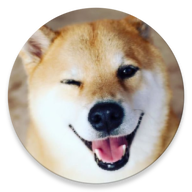

# Nice Animals

## Description

Nice animals is a **simple android app** that shows some pictures of nice 
animals :D

It uses [shibe.online](http://shibe.online) as a source for those pictures

## TODO

* ~~Find out what i will need to save in realm~~
* ~~Dynamically fetch images from shibe.online~~
* ~~Use cats and birds instead of only shibe pics~~ (btw, bird pics were a bad idea)
* ~~Infinite scroll in the recycle view~~

## TODO some day

* Implement realm migration
* Let user chose the image as background for the phone
* Implement tests
* Create landscape mode for listing images

## Notes

* I should be using okHttp, and technically i'm using it with retrofit, i know that
shibe online has one endpoint but i prefer to have it mapped in a interface.
